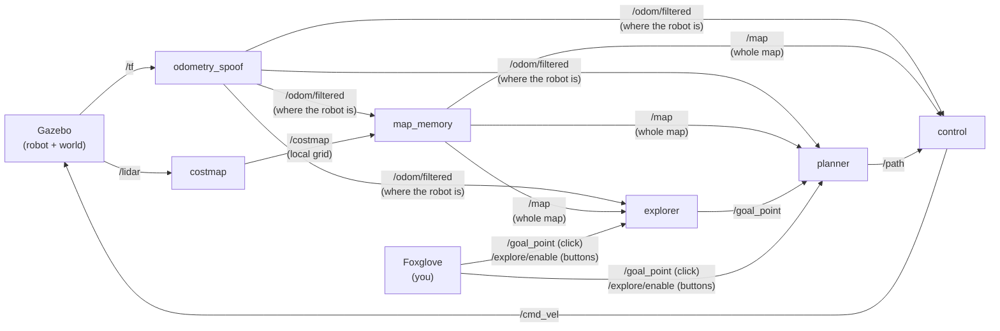

# WATonomous ASD Admission Assignment

A little robot in a simulator that drives to wherever you click without crashing into stuff. And once that worked, I taught it to **explore a building it's never seen and map the whole thing by itself**. Built with ROS 2 Humble, Gazebo and Foxglove, all running in Docker.


*One full run, sped up 12×. The robot starts knowing nothing. From its camera (bottom left) these are just walls, but from above they spell a word, and you watch it show up in the map as the lidar finds each wall. When there's nothing left to explore, it drives back to where it started. (Recorded on my previous version, which drove at half the speed.)*

## What it does

The assignment is four ROS 2 nodes that pass data down a line, lidar in, wheel speeds out:

- **costmap**: turns each laser scan into a grid around the robot: what's empty, what's a wall, and what it hasn't seen yet.
- **map_memory**: glues those grids together into one big map as the robot drives around.
- **planner**: finds a path to the goal on that map with A\*.
- **control**: follows the path with pure pursuit (always aiming at a spot a bit further along it).

Getting a path on the screen was the easy part. Most of my time went into making the robot actually follow it without clipping anything, since it's 2 m long, 1.4 m wide, and turns about a point near its back. The bugs I hit on the way are [further down](#bugs-i-hit-and-how-i-fixed-them), along with [how it does now](#how-well-it-works-now), measured. I also built some stuff that wasn't asked for, mostly for fun: [exploration and two new worlds](#extra-stuff-i-built).

## How the pieces talk



Each box is its own program (a ROS node) and each arrow is a topic, basically a named channel one node posts to and others listen on.

| Node | In short |
|---|---|
| `costmap` | A 30 m × 30 m grid around the robot, 10 cm cells. Walls go where the lidar hits, with a cost fading out 1.6 m around them. Cells no beam has reached stay "unknown". |
| `map_memory` | A 60 m × 40 m map of the whole world. Each scan is placed where the robot was at the moment it was taken. |
| `planner` | A\* for the robot's whole body, not just a point. Every part of it stays 0.3 m from anything, corners get rounded into arcs, and it only plans to turn on the spot where there's room. Replans twice a second. |
| `control` | Pure pursuit from the middle of the wheel axle, up to 1 m/s. Stops and turns on the spot at sharp corners, after checking the body won't hit anything on the way round. |
| `explorer` | My addition. Keeps sending the planner to the edge of what's been explored until there's nothing left. |

## Running it

You only need Docker. Everything else (ROS, Gazebo, all of it) lives inside the containers.

1. Get Linux going (Ubuntu 22.04+, WSL, or a Mac works too), then [install Docker](https://docs.docker.com/engine/install/ubuntu/#install-using-the-repository) and [add yourself to the `docker` group](https://docs.docker.com/engine/install/linux-postinstall/).
2. Build and start everything:

   ```bash
   ./watod build   # first time, and any time you change code
   ./watod up      # add -d to get your terminal back
   ```

3. Open [Foxglove](https://app.foxglove.dev), hit **Open connection**, and use `ws://localhost:20000`. Then import the layout from `config/wato_asd_training_foxglove_config.json`.

### Driving it

- **Send it somewhere:** pick the *Publish point* tool in the 3D panel and click anywhere. It plans a path (green) and drives there.
- **Let it explore:** hit **Start exploring**. The coloured light shows what it's up to (exploring, heading home, done). Cyan cells are the edges of the unknown it's heading for. **Stop exploring** stops it, and clicking your own goal takes over too.
- **From a terminal** (same thing as the button):
  ```bash
  docker exec watod_$USER-robot-1 bash -c "source /opt/watonomous/setup.bash && ros2 topic pub --once /explore/enable std_msgs/msg/Bool '{data: true}'"
  ```

### Picking a world

Set `WORLD` in `watod-config.sh`:

| `WORLD=` | What you get |
|---|---|
| `watonomous` (default) | The word hall. Hit *Start exploring* and watch the word appear. |
| `warehouse` | Four rooms off a main hall. The best test of exploring. |
| `default` | The original arena from the assignment. |

They're all baked into the image, so switching is just a restart:

```bash
./watod down && WORLD=warehouse ./watod up
```

### Running the tests

```bash
# Unit tests for the planner and the explorer
docker run --rm ghcr.io/watonomous/wato_asd_training/robot:main ros2 run planner planner_test
docker run --rm ghcr.io/watonomous/wato_asd_training/robot:main ros2 run explorer explorer_test

# Drive the running world's goal course and measure how it went (start it fresh first)
./watod down && ./watod up -d
tools/course/run_course.sh            # or: tools/course/run_course.sh explore
```

## Bugs I hit and how I fixed them

Roughly in the order I ran into them.

### Getting it to drive at all

**It drove straight into the big cylinder.** The sim's first few lidar scans come back empty. One of those blank scans became the first map update, and the next update wasn't due until the robot had driven 1.5 m, so as far as the planner knew, the arena was empty. Fix: skip scans with nothing in them. They can't tell the map anything anyway.

**It circled the goal forever.** The robot's position comes from the lidar, which sits 1.3 m ahead of the wheel axle. The planner planned for the lidar, but I was steering the axle, so the lidar ended up circling the goal about 0.6 m away, never quite close enough to count. My fix back then was to steer the lidar instead. That came back to bite me (see "the back cut corners" below).

**The side of the robot scraped the big cylinder.** The planner kept the lidar 0.5 m from walls, but the wheels stick out 0.7 m either side of it, so going around the cylinder the body got within 0.06 m. I made the planner's "stay away" zone 0.8 m and the closest call went up to 0.51 m. It worked, but it was a patch over the real problem: the planner thought the robot was a dot.

### Getting the map right

**It knew what was behind walls it had never seen.** After one scan, every cell in the 30 m window counted as empty. Fine for driving, but it leaves nothing to explore. Now a cell only counts as empty once a lidar beam has actually gone through it. It checks the beams on both sides of the cell, so a wall seen at a shallow angle doesn't end up with gaps in it.

**The map froze when the robot stopped.** The map only updated after 1.5 m of driving, so when the robot stopped at a frontier or turned on the spot, whatever it was looking at never made it into the map. Now it also updates every 2 s.

**Walls that weren't there.** Once I started measuring things properly (see [below](#how-well-it-works-now)), the map turned out to have walls in empty space: 39 to 76 cells of them per run in the original arena. The new planner (further down) is pickier about room, and one of those fake walls made it give up on a goal 1.3 m off the big cylinder. The robot wasn't tipping (0.4° at most), so the lidar wasn't seeing the floor. It was timing. Odometry only arrives 10 times a second, and each scan was placed on the map using the newest reading, which was usually a bit *older* than the scan. Turning at 1 rad/s, being 0.1 s off swings a wall 15 m away by more than a metre. Now map_memory holds on to the last second of scans, and only places one once it has an odometry reading from before *and* after it, so it can work out exactly where the robot was in between. That in-between guess assumes the turn rate barely changes in a tenth of a second, so I also made the controller ramp its speed and turning up and down instead of jumping. Fake walls since then: 0, in every run.

### Getting around things without touching them

**The back cut corners.** This was the big known problem in my last version. Since the controller steered the lidar at the front, the rest of the robot followed like a trailer, and on tight turns the back swung into things. Exploring the warehouse, it got as close as 0.11 m, when the back swung around the end of the storage room wall. The planner didn't know any better either, because it planned for a dot with a 0.8 m bubble around it. Fixing it meant redoing both:

- **Everything works from the middle of the wheel axle**, the point the robot actually turns about. That's what the planner plans for and what the controller steers. The path now ends where the axle should stop, so there's nothing to circle, which is the proper fix for the circling bug above.
- **The planner checks the whole body.** It covers the chassis and wheels with 12 circles. For each new map it works out how far every cell is from the nearest wall, so "does the robot fit here, facing this way?" is just 12 lookups. A\* only takes a step if the body fits at both ends of it, facing along it.
- **Corners get rounded into arcs.** Pure pursuit aims at a point ahead, so on a path of straight lines it cuts every corner. Now each corner is rounded into the biggest arc (2.5, 1.8, 1.2 or 0.8 m radius) the body fits along, checked every 10 cm. If none fits, the corner stays sharp, and the controller stops there and turns on the spot.
- **The controller looks before it turns.** Turning on the spot swings the front corners round a 1.6 m circle. It checks that against the map first: if the short way round is blocked it goes the long way, and if both are blocked it backs up a bit.

**It hooked around the goal.** Right next to something, the body only fits facing some ways, so the planner would loop right around the goal to arrive facing one of those, passing 0.12 m from the big cylinder on the way. Now anywhere within 0.25 m of the goal counts as there. Also, the first step of a path has to be one the robot can actually turn to where it's standing.

**It rocked back and forth instead of turning.** Where the short way round only just had room, the controller picked which way to turn fresh every tenth of a second, and kept flipping between the two. Now once it starts turning one way, it keeps going that way.

**It couldn't pick between two routes.** Around something with two ways round that cost about the same, each replan (twice a second, from a slightly different spot) could pick the other one, so the robot kept turning back and forth. Now it sticks with the route it's on unless a new one is at least 1 m shorter, or the old one gets blocked.

**It got stuck at the end of a wall for two and a half minutes.** Pulling out of the warehouse's loading dock, the planner planned a sharp turn right next to the end of a wall, with a crate on the other side. The robot drove up to it, found no room to turn either way, backed up, and the next plan sent it straight back. The planner had never checked that the robot could actually turn there. Three changes:

- A\* only changes direction sharply where the body can turn on the spot, checked every 5°, both ways round.
- When the path gets straightened out, a shortcut only counts if the robot can get round the corner it makes.
- The straightening now looks past the first blocked line. Whether a line is clear depends on which way the body faces along it, so right after a bend the steep lines to the nearest points clip the corner, while the shallower ones further on are fine. It used to stop at the first blocked one, which is how that zig-zag got there in the first place.

There are unit tests for it now. One is set at the bottom of the A and the T in the watonomous world (yes, those two again), with the goal just below the gap between them: with the room check switched off, the planner turns on the spot under the gap with 0.08 m to spare, and the test fails. Another sends the robot on 40 random trips around a small warehouse and checks every route, including every turn on the spot, keeps the real body at least 0.2 m clear.

**It was slow, and long trips timed out.** It drove at 0.5 m/s, and on the far end of the watonomous word it gave up, because 2 minutes wasn't enough. It drives at 1 m/s now (speeding up and slowing down gradually) and gives up after 5 minutes.

### Exploring

**It skipped a room because of a fake frontier.** The costmap puts a cost around walls even on the side it hasn't seen. That left thin bands of fake "seen" floor wrapped around the outside of the building, which joined up into one giant fake frontier, and the robot skipped a room because of it. Now only floor the lidar actually saw counts. There's a unit test for it.

**It gave up on anything behind the word.** To reach the far side of the lettering, the robot has to drive *away* from its goal for a while to get around the word. Measured in a straight line that looked like no progress, so it kept giving up. Now progress is measured along the planned route.

**It crashed through a gap between two letters.** My first version of the lettering had a normal A with slanted legs. That left a wedge-shaped gap next to the T that was wide enough for the old planner (which only kept the lidar 0.8 m from walls) but not for the robot. It took the shortcut and hit the T. Every letter has straight outer sides now, and the world generator refuses any world with a gap like that.

## How well it works now

`tools/course/run_course.sh` sends the robot round a fixed course of awkward goals in each world (around the ends of things, through gaps, turning back on itself), or has it explore the whole world, and measures how it went. None of it is measured from the robot's own map: the obstacles come straight from the world file and the robot's shape from its model, so **closest call** is the real gap between the robot's body and the nearest real thing. **Fake walls** counts wall cells on the robot's map more than 0.2 m from anything real. [More on how it works.](tools/course/README.md)

"Before" is my previous version, the one with the trailer problem. Same sim, same courses, one run each.

| World | Test | Before | After |
|---|---|---|---|
| Original arena | 7 goals | 7/7 in 3 min 41 s. Closest call 0.52 m, 39 fake wall cells | 7/7 in 2 min 4 s. Closest call 0.55 m, 0 fake wall cells |
| | Explore | Done in 3 min 39 s, 100% mapped. Closest call 0.30 m, 6 fake wall cells | Done in 1 min 56 s, 100% mapped. Closest call 0.81 m, 0 fake wall cells |
| Warehouse | 5 goals | 5/5 in 3 min 27 s. Closest call 0.28 m, 15 fake wall cells | 5/5 in 2 min 4 s. Closest call 0.34 m, 0 fake wall cells |
| | Explore | Done in 2 min 52 s, 99.5% mapped. Closest call 0.16 m, 2 fake wall cells | Done in 1 min 40 s, 99.5% mapped. Closest call 0.53 m, 0 fake wall cells |
| Watonomous | 5 goals | 4/5 (one timed out) in 6 min 52 s. Closest call 0.37 m, 82 fake wall cells | 5/5 in 3 min 38 s. Closest call 0.73 m, 0 fake wall cells |
| | Explore | Done in 4 min 44 s, 99.7% mapped. Closest call 0.28 m, 5 fake wall cells | Done in 2 min 35 s, 99.6% mapped. Closest call 0.60 m, 0 fake wall cells |

Every run takes 40 to 50% less time, but that's mostly just the robot driving twice as fast. The part I actually care about is the closest calls. Every one went up, and the tightest is now 0.34 m (going past a crate in the warehouse), where before it was 0.16 m (a stack of pallets). There are no fake walls in any run, and in none of them did the robot have to back out of anywhere. Runs do vary a bit, though: on the old code, exploring the original arena took 2 min 58 s one time and 3 min 39 s the next.

Unit tests: planner 8/8, explorer 8/8.

## Extra stuff I built

Once the robot could drive to a point, the original arena got boring fast: it can see almost the whole thing from where it spawns, so there's nothing to figure out. I wanted to see it deal with a place it *couldn't* see, and I wanted a demo that was actually cool to watch.

### Autonomous exploration

The assignment robot only goes where you tell it. I wanted it to go find stuff on its own, like a robot vacuum mapping a new house.

The trick is a *frontier*: the border between floor the robot has already seen and space it hasn't. Drive to a frontier, the lidar sees past it, the unknown shrinks, new frontiers show up further out. Repeat until there are none you can reach, then drive home. Once a second the explorer:

1. Flood-fills out from the robot (breadth-first search) to find every spot it can actually get to, so it doesn't chase frontiers behind walls.
2. Marks every reachable, seen-as-empty cell that touches unknown space.
3. Groups touching cells into patches, ignores tiny ones, and sends the closest patch to the planner as a goal.
4. Gives up on a goal if it gets there, if the lidar already saw past it, if the planner can't find a path, or if the robot stops making progress for 20 s.

It's its own C++ node (`src/robot/explorer`). The frontier search lives in a library so it can be unit tested with GoogleTest, with the test maps drawn as text right in the code. It talks to everything else over normal topics: it publishes goals on `/goal_point` just like a Foxglove click, listens for on/off on `/explore/enable` (the two Foxglove buttons), reports its state on `/explore/status`, and draws the frontiers in Foxglove as markers.

### Two new worlds, one of them spelling WATONOMOUS

Exploring needs somewhere worth exploring. And a word that only shows up in the robot's map felt like the best way to show the map is really built from what the lidar sees.

- **`watonomous`**: a 55 m × 20 m hall with walls down the middle spelling WATONOMOUS from above.
- **`warehouse`**: four rooms (storage racks, a pallet room, an office, a loading dock with a truck) off a main hall. ([GIF](docs/demo_warehouse.gif))

Every obstacle in both worlds is listed once, in a Python script (`src/gazebo/tools/make_worlds.py`). The letters come from a tiny block font I defined as lines on a grid, and each line becomes a wall. From that one list the script writes the Gazebo world (SDF) that actually gets simulated, and a matching URDF that Foxglove draws, so the two can't disagree. The robot and its sensors are copied straight from the assignment's world, so nothing about the robot changes. Before writing anything, the script checks every room can be reached, and that there's no gap that looks passable but that the robot's body won't fit through (see the A and the T above). Every obstacle is also at least 1.3 m tall, because the lidar scans a flat slice 0.9 m off the ground and can't see anything shorter.

### Measuring it

- `tools/course/`: the course runs above.
- `tools/demo/`: records the GIFs. It saves a picture of the map, the camera image and some stats every second, then stitches them into a GIF with ffmpeg, all inside Docker.
- Unit tests in `src/robot/planner/test` and `src/robot/explorer/test`. The planner tests check every route against the exact shapes of the obstacles rather than the planner's own map, so they'd catch the planner fooling itself too.

## Still not perfect

- **Pure pursuit still shaves arcs a little.** It aims 1 m ahead, so it starts turning a moment before each arc does. The planner's 0.3 m margin covers that: the tightest call across all six runs above was 0.34 m.
- **It only drives forwards.** Backing up is just the controller's last resort, in a straight line, when it has no room to turn. A planner that could plan reversing, like parallel parking, would get out of tight spots faster.
- **The planner searches over position, not position and heading.** It checks the heading as it goes, which covers nearly everything, but in a really tight spot it could miss a way through that a smarter search would find.
- **Short stuff is invisible.** The lidar only sees a flat slice 0.9 m off the ground. That's why every obstacle in my worlds is at least 1.3 m tall.
- **Optimistic planning.** The planner treats unknown space as free and replans once it sees what's really there. That's on purpose (otherwise it could never head into the unknown), but it means paths can change a lot early on.

## Where things are

```
src/robot/
  costmap/        lidar scan -> local grid
  map_memory/     local grids -> whole map
  planner/        A* path planning for the whole body (+ unit tests in test/)
  control/        pure pursuit path following
  explorer/       autonomous exploration (+ unit tests in test/)
  bringup_robot/  launches all of the above
  odometry_spoof/ robot position from the simulator (provided)
src/gazebo/
  launch/         sim launch file, the worlds (.sdf) and what Foxglove draws (.urdf)
  tools/          make_worlds.py, builds the warehouse and watonomous worlds
config/           Foxglove layout
tools/course/     drives a fixed course in each world and measures it
tools/demo/       scripts that record the demo GIFs
docker/, modules/, watod   Docker setup and the watod wrapper (provided)
```

## Credits

Built on the [WATonomous](https://www.watonomous.ca/) ASD admission assignment, which gave me the simulated robot, the Docker/`watod` setup, and the starting skeleton for each node. Simulation by [Gazebo](https://gazebosim.org/), visualization by [Foxglove](https://foxglove.dev/).
