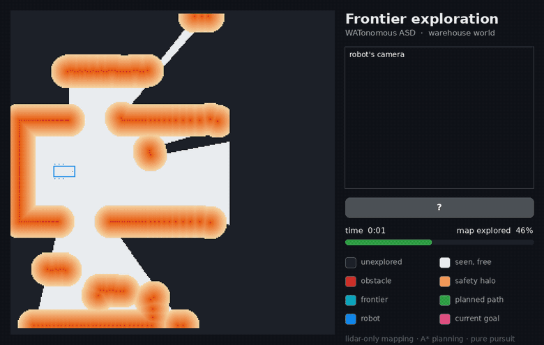
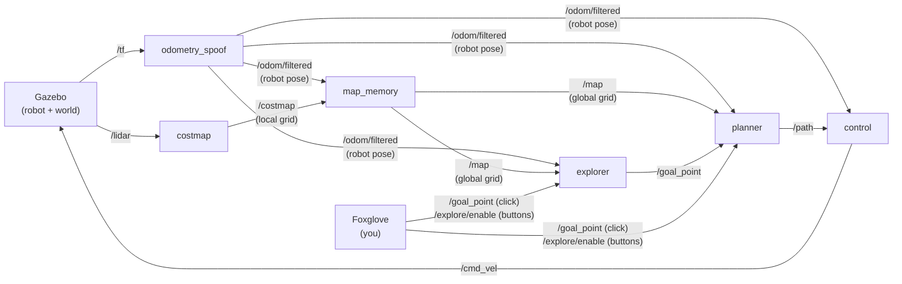

# WATonomous ASD Admission Assignment

A simulated differential-drive robot that navigates to any point you click while avoiding obstacles, and can also **explore and map an unknown building on its own**. It uses ROS 2 Humble, Gazebo, and Foxglove, and all of it runs in Docker.



*One uninterrupted autonomous run in the warehouse world at 12× speed. The robot starts with an empty map, uses only its lidar to map all four rooms, and drives back to where it started. On the left is the map as the robot builds it, and on the right is the robot's camera.*

## What's in here

**The assignment.** Four ROS 2 nodes form the navigation pipeline:

- **costmap**: turns each lidar scan into a grid of free, unknown, and obstacle cells, with a safety margin (inflation) around obstacles.
- **map_memory**: stitches those snapshots into one global map as the robot moves.
- **planner**: finds a path with A\*.
- **control**: follows the path with pure pursuit.

**Extras beyond the assignment:**

- **Autonomous exploration** (`src/robot/explorer`). Press *Start exploring* in Foxglove and the robot keeps driving to the edge of what it has mapped (the *frontier*) until nothing reachable is left. Then it returns to where it started. *Stop exploring* halts it at any time, and clicking your own goal hands control back to you.
- **A custom warehouse world** (`src/gazebo/tools/make_warehouse.py`). It has four rooms off a main hall, with racks, pallet stacks, bollards, desks, and a delivery truck. From the start the robot can only see part of it, which is what makes exploring worthwhile. Every obstacle is listed once, in Python, and the script generates both the Gazebo world and the matching model Foxglove draws. Before writing anything, it checks that every room is reachable. The original arena is still available.
- **Unknown space in the costmap.** A cell is free only if a lidar beam actually passed through it; everything else stays *unknown*. Without this, the robot would think it had seen the whole arena after one scan. Exploration depends on it.
- **Unit tests** for the frontier search, plus scripted end-to-end tests that were run in the simulator (results below).

## How it works



| Node | Listens to | Publishes | Job |
|---|---|---|---|
| `costmap` | `/lidar` | `/costmap` | Robot-centred 30 m × 30 m grid at 0.1 m/cell: `-1` unknown, `0` free, `1-100` obstacle cost. Obstacles are inflated 1.6 m. |
| `map_memory` | `/costmap`, `/odom/filtered` | `/map` | Merges costmaps into a 40 m × 40 m global map, keeping the highest cost ever seen per cell. It updates every 1.5 m of travel or 2 s. |
| `planner` | `/map`, `/goal_point`, `/goal_cancel`, `/odom/filtered` | `/path` | 8-connected A\* that stays out of cells costing ≥ 50 (within 0.8 m of an obstacle) and prefers paths away from walls. It replans every 0.5 s and whenever the map changes. |
| `control` | `/path`, `/odom/filtered` | `/cmd_vel` | Pure pursuit with a 1 m lookahead. It turns on the spot when the target is more than 60° off. |
| `explorer` | `/map`, `/odom/filtered`, `/path`, `/explore/enable`, `/goal_point` | `/goal_point`, `/goal_cancel`, `/explore/status`, `/explore/frontiers` | Frontier exploration: it sends the planner to the nearest reachable frontier, one at a time. |

## Running it

### Setup

These steps set up the monorepo on your own PC. Everything runs in Docker, so you don't need to install ROS or Gazebo on your machine.

1. This assignment supports Linux Ubuntu >= 22.04, Windows (WSL), and macOS. You can set up an [Ubuntu Virtual Machine](https://ubuntu.com/tutorials/how-to-run-ubuntu-desktop-on-a-virtual-machine-using-virtualbox#1-overview), [WSL](https://learn.microsoft.com/en-us/windows/wsl/install), or a [dual boot](https://opensource.com/article/18/5/dual-boot-linux).
2. Once inside Linux, [install Docker Engine using the `apt` repository](https://docs.docker.com/engine/install/ubuntu/#install-using-the-repository), and [add yourself to the `docker` group](https://docs.docker.com/engine/install/linux-postinstall/).
3. The original assignment is on the [WATonomous wiki](https://wiki.watonomous.ca/).

### Start the robot

```bash
./watod build   # first time, and after changing any code
./watod up      # add -d to run in the background
```

Then open [Foxglove](https://app.foxglove.dev) and use **Open connection** with `ws://localhost:20000`. Import the layout from `config/wato_asd_training_foxglove_config.json`, which has the 3D view, camera, teleop, and exploration controls.

### Drive it

- **Go to a point:** in the 3D panel, pick the *Publish point* tool and click anywhere. The robot plans a path (green) and drives there.
- **Explore on its own:** press **Start exploring**. The light above the buttons shows the explorer's state (*Exploring*, *Returning home*, *Map complete*). Cyan cells are frontiers and the pink ball is the current target. **Stop exploring** stops the robot where it is, and clicking a point also takes over.
- **From a terminal** (same effect as the buttons):
  ```bash
  docker exec watod_$USER-robot-1 bash -c "source /opt/watonomous/setup.bash && ros2 topic pub --once /explore/enable std_msgs/msg/Bool '{data: true}'"
  ```

### Pick a world

`watod-config.sh` sets `WORLD` to `warehouse`, the custom world, or `default`, the assignment's original arena. Both are built into the image, so switching just needs a restart:

```bash
./watod down && WORLD=default ./watod up
```

To change the warehouse, edit `OBSTACLES` in `src/gazebo/tools/make_warehouse.py`, then run it and rebuild:

```bash
python3 src/gazebo/tools/make_warehouse.py && ./watod build gazeboserver
```

### Run the tests

```bash
docker run --rm ghcr.io/watonomous/wato_asd_training/robot:main ros2 run explorer explorer_test
```

## Results

All numbers were measured in the simulator. The closest-approach figure is the smallest gap between the robot's **body** (chassis and wheels) and any obstacle. It's computed every 0.1 s from the robot's pose and the true obstacle positions (see `tools/demo/record_run.py`).

| Test | Result |
|---|---|
| Warehouse, exploration from an empty map (the GIF above) | Finished and back home in **2 min 49 s**, with **99.3%** of the building's floor mapped. The only unmapped floor is the gap behind the truck, which no sensor can see into. Closest approach **0.12 m** (0.21 m in a second run) |
| Original arena, three clicked goals across it | All three reached (30–44 s each) |
| Exploration switched off, on again, then a clicked goal mid-exploration | Stops, clears its path, and doesn't move while off. Resumes when switched on. Hands over to the clicked goal and drives there (6/6 checks) |
| Frontier search unit tests | 8/8 passing |

## Design notes

- **Free vs. unknown.** A grid cell is only marked free if the lidar beams on *both* sides of its direction reach past it. With only the nearest beam, a wall seen at a shallow angle, where hits land far apart, would get free cells marked between its hits.
- **Safety margin.** Obstacles are inflated 1.6 m, and the planner won't enter cells costing 50 or more, so it keeps the lidar 0.8 m from anything. The robot's body is 1.4 m wide, and 1.8 m of it trails *behind* the lidar, so that's about the smallest margin that leaves daylight on both sides.
- **The frontier rule.** A frontier cell has to be floor the lidar actually saw as empty, with cost exactly 0. The costmap also inflates into space it has never seen, such as behind walls and inside boxes, so that it keeps the robot clear of the far side of a wall. That leaves thin bands of "known" cells next to real unknown space. In testing, those bands ringed the whole building from the outside and got merged into one giant fake frontier. The robot then gave up on it and missed a room. A regression test now covers this.
- **Map updates while stopped.** The assignment suggests fusing a new costmap only after 1.5 m of travel. When the robot stops at a frontier or turns on the spot, it can see new space without moving that far, so the map also updates every 2 s.
- **Known limitations.** The controller steers the lidar at the front of the robot, and the rest of the body follows like a trailer, so it cuts corners slightly. In both measured runs, the closest approach came from the rear swinging around the end of the storage-room wall during a tight turn. A footprint-aware planner would fix this. The lidar only scans a flat plane 0.9 m above the floor, so anything lower is invisible to it. That's why every obstacle in the warehouse is at least 1.3 m tall. The planner also treats unknown space as free, and it replans once it sees what's actually there.

## Repository layout

```
src/robot/
  costmap/        lidar scan -> local occupancy grid
  map_memory/     local grids -> global map
  planner/        A* path planning
  control/        pure pursuit path following
  explorer/       frontier-based exploration (+ unit tests in test/)
  bringup_robot/  launches all of the above
  odometry_spoof/ robot pose from the simulator (provided)
src/gazebo/
  launch/         sim launch file, worlds (.sdf) and their Foxglove models (.urdf)
  tools/          make_warehouse.py, the warehouse generator
config/           Foxglove layout
tools/demo/       scripts that record the demo GIF
docker/, modules/, watod   container setup and the watod wrapper (provided)
```

## Credits

Built on the [WATonomous](https://www.watonomous.ca/) ASD admission assignment, which provided the simulated robot, the Docker/`watod` infrastructure, and the node skeletons. Simulation by [Gazebo](https://gazebosim.org/), visualization by [Foxglove](https://foxglove.dev/).
