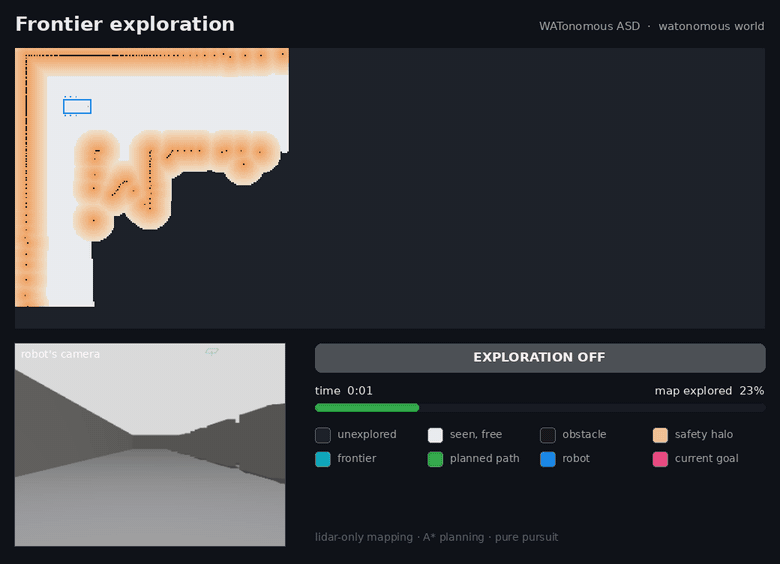
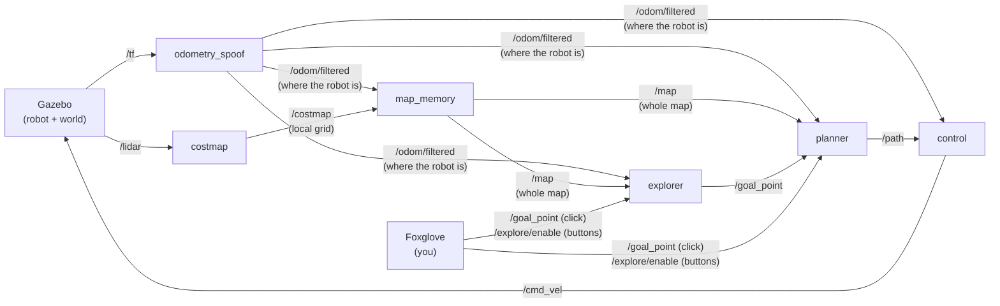

# WATonomous ASD Admission Assignment

A little robot in a simulator that drives to wherever you click without crashing into stuff. And once that worked, I taught it to **explore a building it's never seen and map the whole thing by itself**. Built with ROS 2 Humble, Gazebo and Foxglove, all running in Docker.



*One full run, sped up 12×. The robot starts knowing nothing. From its camera (bottom left) these are just walls, but from above they spell a word, and you watch it show up in the map as the lidar finds each wall. When there's nothing left to explore, it drives back to where it started.*

## What it does

The assignment is four ROS 2 nodes that pass data down a line, lidar in, wheel speeds out:

- **costmap**: takes each laser scan and turns it into a grid around the robot: what's empty, what's a wall, what's too close to a wall.
- **map_memory**: glues those grids together into one big map as the robot drives around.
- **planner**: finds a path to the goal on that map using A\*.
- **control**: follows the path with pure pursuit (always aiming at a spot a bit further along the path).

On top of that I added a bunch of stuff that wasn't asked for, mostly for fun. That's all in [Extra stuff I built](#extra-stuff-i-built-outside-the-assignment) below.

## How the pieces talk



Each box is its own program (a ROS node) and each arrow is a topic, basically a named channel one node posts to and others listen on.

| Node | In short |
|---|---|
| `costmap` | A 30 m × 30 m grid around the robot, 10 cm cells. Every wall gets a 1.6 m "stay away" zone around it. |
| `map_memory` | A 60 m × 40 m map of the whole world. Updates every 1.5 m of driving, or every 2 s if the robot's sitting still. |
| `planner` | A\* that won't go within 0.8 m of a wall and prefers the middle of hallways. Replans twice a second. |
| `control` | Aims at a point 1 m ahead on the path. Turns on the spot if that point is way off to the side. |
| `explorer` | My addition. Keeps sending the planner to the edge of what's been explored until there's nothing left. |

## Running it

You only need Docker. Everything else (ROS, Gazebo, all of it) lives inside the containers.

1. Get Linux going (Ubuntu 22.04+, WSL, or a Mac works too), then [install Docker](https://docs.docker.com/engine/install/ubuntu/#install-using-the-repository) and [add yourself to the `docker` group](https://docs.docker.com/engine/install/linux-postinstall/).
2. Build and start everything:

   ```bash
   ./watod build   # first time, and any time you change code
   ./watod up      # add -d to get your terminal back
   ```

3. Open [Foxglove](https://app.foxglove.dev), hit **Open connection**, and use `ws://localhost:20000`. Then import the layout from `config/wato_asd_training_foxglove_config.json`.

### Driving it

- **Send it somewhere:** pick the *Publish point* tool in the 3D panel and click anywhere. It plans a path (green) and drives there.
- **Let it explore:** hit **Start exploring**. The coloured light shows what it's up to (exploring, heading home, done). Cyan cells are the edges of the unknown it's heading for. **Stop exploring** stops it, and clicking your own goal takes over too.
- **From a terminal** (same thing as the button):
  ```bash
  docker exec watod_$USER-robot-1 bash -c "source /opt/watonomous/setup.bash && ros2 topic pub --once /explore/enable std_msgs/msg/Bool '{data: true}'"
  ```

### Picking a world

Set `WORLD` in `watod-config.sh`:

| `WORLD=` | What you get |
|---|---|
| `watonomous` (default) | The word hall. Hit *Start exploring* and watch the word appear. |
| `warehouse` | Four rooms off a main hall. The best test of exploring. |
| `default` | The original arena from the assignment. |

They're all baked into the image, so switching is just a restart:

```bash
./watod down && WORLD=warehouse ./watod up
```

### Running the tests

```bash
docker run --rm ghcr.io/watonomous/wato_asd_training/robot:main ros2 run explorer explorer_test
```

## Extra stuff I built (outside the assignment)

Honestly, most of this was for fun. Once the robot could drive to a point, the original arena got boring fast: it can see almost the whole thing from where it spawns, so there's nothing to figure out. I wanted to see it deal with a place it *couldn't* see, and I wanted a demo that was actually cool to watch. Here's what I added, why, and how each one works.

### 1. Autonomous exploration

**Why:** The assignment robot only goes where you tell it. I wanted it to go find stuff on its own, like a robot vacuum mapping a new house.

**How it works:** The trick is a *frontier*: the border between floor the robot has already seen and space it hasn't. Drive to a frontier, the lidar sees past it, the unknown shrinks, new frontiers show up further out. Repeat until there are none you can reach, then drive home. Once a second the explorer:

1. Flood-fills out from the robot (breadth-first search) to find every spot it can actually get to, so it doesn't chase frontiers behind walls.
2. Marks every reachable, seen-as-empty cell that touches unknown space.
3. Groups touching cells into patches, ignores tiny ones, and sends the closest patch to the planner as a goal.
4. Gives up on a goal if it gets there, if the lidar already saw past it, if the planner can't find a path, or if the robot stops making progress for 20 s.

**Built with:** a new C++ ROS 2 node (`src/robot/explorer`, using `rclcpp`). The frontier search lives in its own library so it can be unit tested with GoogleTest: 8 tests, with their maps drawn as text right in the code. It talks to the rest of the system over normal ROS topics: it publishes goals on `/goal_point` just like a Foxglove click, listens for on/off on `/explore/enable` (the two Foxglove buttons publish a `std_msgs/Bool`), reports its state on `/explore/status`, and draws the frontiers in Foxglove with a `visualization_msgs/MarkerArray`.

**Two bugs worth mentioning:**
- The costmap puts a safety zone around walls even on the side it hasn't seen. That left thin bands of fake "seen" floor wrapped around the outside of the building, which all joined up into one giant fake frontier, and the robot skipped a room because of it. Fix: only floor the lidar *actually* saw counts. There's a unit test for it now.
- To reach the far side of the lettering, the robot has to drive *away* from its goal for a while to get around the word. Measured in a straight line that looked like no progress, so it kept giving up. Now progress is measured along the planned route.

### 2. Two new worlds, one of them spelling WATONOMOUS

**Why:** Exploration needs somewhere worth exploring. And a word that only shows up in the robot's map felt like the best way to show the map is really built from what the lidar sees.

- **`watonomous`**: a 55 m × 20 m hall with walls down the middle spelling WATONOMOUS from above.
- **`warehouse`**: four rooms (storage racks, a pallet room, an office, a loading dock with a truck) off a main hall.

**How it works:** Every obstacle in both worlds is listed once, in a Python script (`src/gazebo/tools/make_worlds.py`). The letters come from a tiny block font I defined as lines on a grid, and each line becomes a wall. From that one list the script writes two files:

- a **Gazebo world** (SDF, which is XML) that Ignition Gazebo actually simulates, with physics, lidar and camera. The robot and sensors are copied straight from the assignment's original world so nothing about the robot changes.
- a matching **URDF** of the same shapes. `robot_state_publisher` publishes it on `/env_description` so Foxglove draws whichever world is running.

The world is picked with `WORLD` in `watod-config.sh`, which Docker Compose passes into the Gazebo container as an environment variable, and the launch file (`sim.launch.py`) loads the right files.

Before writing anything, the script checks the world is actually drivable. It lays a 10 cm grid over it and runs a breadth-first search to make sure every room can be reached. It also checks there's no gap the planner would try to squeeze through that the robot's body won't fit through.

**Why that last check exists:** my first version of the lettering had a normal A with slanted legs. That left a wedge-shaped gap next to the T that was wide enough for the planner (which only keeps the lidar 0.8 m from walls) but not for the 1.4 m-wide robot. It took the shortcut and hit the T. Now every letter has straight outer sides and the script refuses any world with a gap like that. Also, every obstacle is at least 1.3 m tall, because the lidar scans a flat slice 0.9 m off the ground and can't see anything shorter.

### 3. A few upgrades to the assignment nodes

These are in the required nodes, but go past what the assignment asked for:

- **The costmap knows what it hasn't seen.** A cell only counts as empty if a laser beam actually passed through it; everything else stays "unknown". Without this, one scan makes the robot think it's seen the whole arena and there's nothing to explore. It also checks the beams on *both* sides of a cell, so walls seen at a shallow angle don't get holes in them.
- **The map updates while sitting still.** The assignment says to update after driving 1.5 m. But when the robot stops and turns on the spot, it sees new stuff without moving, so the map also updates every 2 s.
- **Scans get matched to where the robot *was*.** Each scan gets pasted into the map using the robot's position at the exact moment the scan was taken, not whenever it gets processed. Otherwise walls smear when the robot turns.
- **The controller steers the lidar, not the axle.** The robot's position comes from the lidar, which sits 1.3 m ahead of the wheels, so the controller aims that point straight at the path. It lands exactly on the goal, but the back of the robot trails like a trailer (see "not perfect yet" below).
- **The planner stays out of tight spots.** Steps next to walls cost more, so paths stick to the middle of hallways. It won't cut corners diagonally, it can back out if the robot ends up too close to a wall, and it straightens out A\*'s zig-zag steps into straight lines.

### 4. Recording the demos

**Why:** I wanted GIFs for this README, and real numbers instead of "it seems to work".

**How it works:** `tools/demo/record_run.py` is a small Python ROS node (`rclpy`) that runs inside the robot container. Once a second it saves a top-down picture of the map, the camera image, and some stats. It also imports the world list from `make_worlds.py`, so it knows where the walls *really* are, and uses that to measure how close the robot's body ever gets to hitting something. `compose_frames.py` lays each frame out with Pillow, and `make_demo.sh` runs everything and stitches the frames into a GIF and MP4 with ffmpeg, all inside Docker so you don't need to install anything.

## Results

All measured in the simulator. "Closest call" is the smallest gap between the robot's **body** (not just the lidar) and any obstacle during the run.

| Test | How it went |
|---|---|
| `watonomous`, exploring from an empty map (the GIF above) | Done and back home in **4 min 54 s**, **99.7%** of the hall mapped, every letter drawn from lidar alone. Closest call **0.32 m**. |
| `warehouse`, exploring from an empty map ([GIF](docs/demo_warehouse.gif)) | Done and back home in **2 min 51 s**, **99.4%** of the floor mapped. The only bit it missed is behind the truck, which nothing can see into. Closest call **0.21 m** (0.12 m in an earlier run). |
| Original arena, three clicked goals across it | All three reached, 31–45 s each. |
| Exploring off, on again, then clicking a goal mid-explore | Stops and stays put when off, picks back up when on, hands over to the click (6/6 checks). |
| Frontier search unit tests | 8/8 passing. |

## Not perfect yet

- **Corner cutting.** Since the controller steers the lidar at the front, the rest of the body follows like a trailer and cuts corners a bit on tight turns. All the closest calls in the warehouse came from that, like the back swinging around the end of the storage-room wall. A planner that knows the robot's full shape would fix it.
- **Short stuff is invisible.** The lidar only sees a flat slice 0.9 m off the ground. That's why every obstacle in my worlds is at least 1.3 m tall.
- **Optimistic planning.** The planner treats unknown space as free and just replans once it sees what's really there. That's on purpose (otherwise it could never head into the unknown), but it means paths can change a lot early on.

## Where things are

```
src/robot/
  costmap/        lidar scan -> local grid
  map_memory/     local grids -> whole map
  planner/        A* path planning
  control/        pure pursuit path following
  explorer/       autonomous exploration (+ unit tests in test/)
  bringup_robot/  launches all of the above
  odometry_spoof/ robot position from the simulator (provided)
src/gazebo/
  launch/         sim launch file, the worlds (.sdf) and what Foxglove draws (.urdf)
  tools/          make_worlds.py, builds the warehouse and watonomous worlds
config/           Foxglove layout
tools/demo/       scripts that record the demo GIFs
docker/, modules/, watod   Docker setup and the watod wrapper (provided)
```

## Credits

Built on the [WATonomous](https://www.watonomous.ca/) ASD admission assignment, which gave me the simulated robot, the Docker/`watod` setup, and the starting skeleton for each node. Simulation by [Gazebo](https://gazebosim.org/), visualization by [Foxglove](https://foxglove.dev/).
